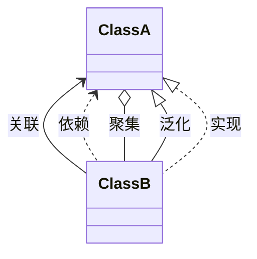

## 对象和类之间相互关系

UML 中描述对象和类之间相互关系的方式包括：**依赖**（Dependency），**关联**（Association），**聚合**（Aggregation），**组合**（Composition），**泛化**（Generalization），**实现**（Realization）等。

## 含义

**泛化**（Generalization）：通常所说的继承（特殊个体 is kind of 一般个体）关系，不必多解释了。UML 用带空心箭头的实线线表示 Generalization 关系，箭头指向一般个体。
实现（Realize）：元素 A 定义一个约定，元素 B 实现这个约定，则 B 和 A 的关系是 Realize，B realize A。这个关系最常用于接口。UML 用空心箭头和虚线表示 Realize 关系，箭头指向定义约定的元素。
**聚合**（Aggregation）：关联关系的一种特例，表示部分和整体（整体 has a 部分）的关系。UML 用带空心菱形头的实线表示 Aggregation 关系，菱形头指向整体。
组合（Composition）：组合是聚合关系的变种，表示元素间更强的组合关系。如果是组合关系，如果整体被破坏则个体一定会被破坏，而聚合的个体则可能是被多个整体所共享的，不一定会随着某个整体的破坏而被破坏。UML 用带实心菱形头的实线表示 Composition 关系，菱形头指向整体。
**依赖**（Dependency）：元素 A 的变化会影响元素 B，但反之不成立，那么 B 和 A 的关系是依赖关系，B 依赖 A；类属关系和实现关系在语义上讲也是依赖关系，但由于其有更特殊的用途，所以被单独描述。UML 用带箭头的虚线表示 Dependency 关系，箭头指向被依赖元素。
**关联**（Association）：元素间的结构化关系，是一种弱关系，被关联的元素间通常可以被独立的考虑。UML 用实线表示 Association 关系，箭头指向被依赖元素。

## 五种类间关系的图形表示介绍：

| 关联     | 依赖     | 聚集   | 泛化 extends | 实现 implements        |
|:------:|:------:|:----:|:----------:|:--------------------:|
| 带实线的箭头 | 带虚线的箭头 | 菱形箭头 | 带实线的三角形箭头  | 带虚线的三角形箭头 implements |

